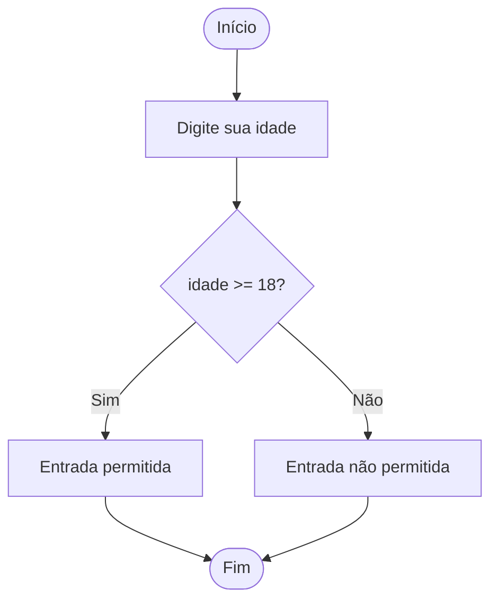

# 💻 Técnica de Desenvolvimento de Algoritmos - Prova A1

Repositório dedicado a exercícios básicos em Python, desenvolvidos para a avaliação regimental (A1) da disciplina **Técnica de Desenvolvimento de Algoritmos** da UDF.

---

## 📂 Organização do Repositório

O diretório `exercicios/` contém todos os programas desenvolvidos para a avaliação.

exercicios/
├── exercicio1-verificacao-idade.py
├── exercicio2-contar-pares.py
├── exercicio3-lista-alunos.py
└── exercicio4-cadastro-produtos.py

---

## ✨ Detalhamento dos Exercícios

Cada arquivo Python implementa uma funcionalidade específica, conforme descrito abaixo:

---

### 1. `exercicio1-verificacao-idade.py`
**Tema:** Estrutura Condicional Simples.

**Descrição:**  
O programa solicita a idade do usuário e verifica se ela é maior ou igual à maioridade legal (≥ 18). Caso seja, a entrada ao evento é permitida; caso contrário, é negada.

## Fluxograma



---

### 2. `exercicio2-contar-pares.py`
**Tema:** Estrutura de Repetição.

**Descrição:**  
Realiza uma contagem de 0 a 100, exibindo somente os números pares. Números ímpares são ignorados durante a iteração.

## Fluxograma 
```mermaid
flowchart TD

    A([Início]) --> B[Mostrar menu<br>1. For<br>2. While]
    B --> C[escolha = input()]
    C --> D{escolha == 1?}

    %% --- Caminho FOR ---
    D -->|Sim| E[Mostrar "Método For escolhido"]
    E --> F{contador = 1 até 100}
    F --> G{contador % 2 == 0?}
    G -->|Sim| H[print(contador)]
    G -->|Não| I[Ignorar número]
    H --> J[Esperar 0.5s]
    I --> J
    J --> K{Mais números?}
    K -->|Sim| F
    K -->|Não| L[print("Fim :)")]

    %% --- Caminho WHILE ---
    D -->|Não| M[Mostrar "Método While escolhido"]
    M --> N[contador = 0]
    N --> O{contador < 100?}
    O -->|Sim| P[contador += 1]
    P --> Q{contador % 2 == 0?}
    Q -->|Sim| R[print(contador)]
    Q -->|Não| S[Ignorar número]
    R --> T[Esperar 0.5s]
    S --> T
    T --> O
    O -->|Não| U[print("Fim :)")]

    %% --- Final ---
    L --> V([Fim])
    U --> V([Fim])
```

---

### 3. `exercicio3-lista-alunos.py`
**Tema:** Manipulação de Listas (CRUD Básico) e Menu de Opções.

**Descrição:**  
Sistema com menu interativo para gerenciamento de uma lista de alunos. Funções disponíveis:

- Consultar lista de alunos  
- Adicionar novos alunos  
- Remover alunos existentes  
- Encerrar o programa

---

### 4. `exercicio4-cadastro-produtos.py`
**Tema:** Manipulação de Dicionários (CRUD Básico) e Menu de Opções.

**Descrição:**  
Sistema com menu interativo para gerenciamento de um dicionário de produtos, onde:

- **Chave:** nome do produto  
- **Valor:** preço do produto  

Operações disponíveis:

- Adicionar um novo produto  
- Remover um produto pelo nome  
- Consultar produtos e preços cadastrados  
- Encerrar o programa

---
