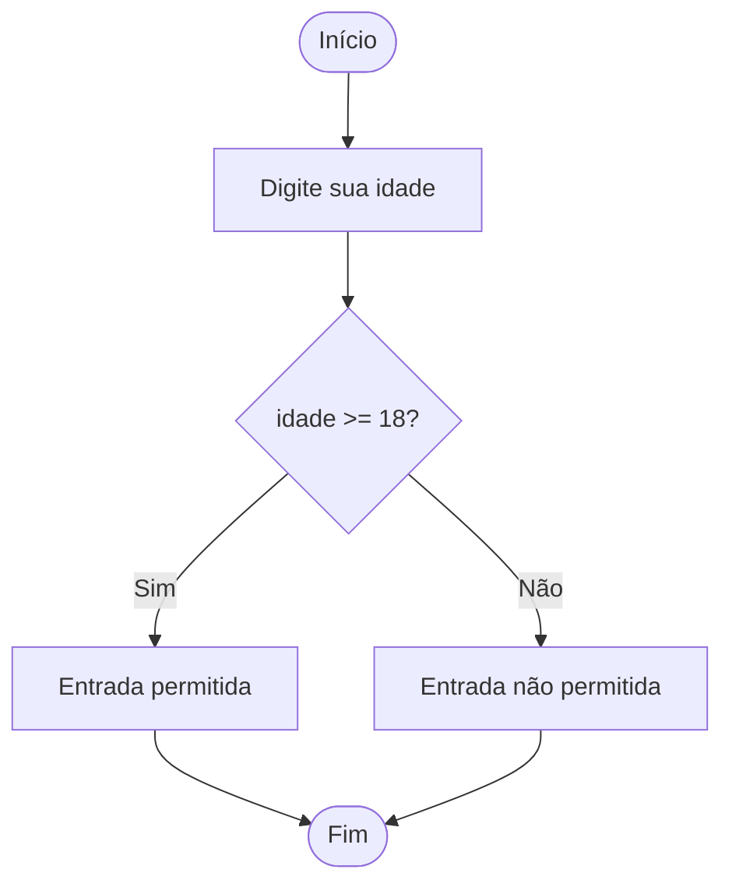
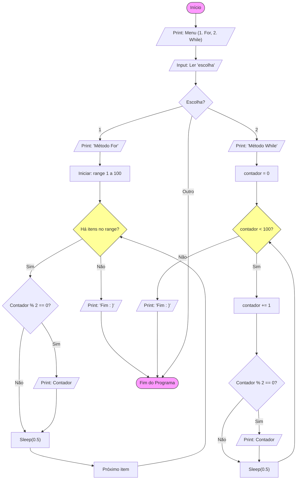

# 💻 Técnica de Desenvolvimento de Algoritmos - Prova A1

Repositório dedicado a exercícios básicos em Python, desenvolvidos para a avaliação regimental (A1) da disciplina **Técnica de Desenvolvimento de Algoritmos** da UDF.

---

## 📂 Organização do Repositório

O diretório `exercicios/` contém todos os programas desenvolvidos para a avaliação.

exercicios/
├── exercicio1-verificacao-idade.py
├── exercicio2-contar-pares.py
├── exercicio3-lista-alunos.py
└── exercicio4-cadastro-produtos.py

---

## ✨ Detalhamento dos Exercícios

Cada arquivo Python implementa uma funcionalidade específica, conforme descrito abaixo:

---

### 1. `exercicio1-verificacao-idade.py`
**Tema:** Estrutura Condicional Simples.

**Descrição:**  
O programa solicita a idade do usuário e verifica se ela é maior ou igual à maioridade legal (≥ 18). Caso seja, a entrada ao evento é permitida; caso contrário, é negada.

## Fluxograma

```mermaid
flowchart TD
    A([Início]) --> B[Digite sua idade]
    B --> C{idade >= 18?}
    C -->|Sim| D[Entrada permitida]
    C -->|Não| E[Entrada não permitida]
    D --> F([Fim])
    E --> F([Fim])
``` 

---

### 2. `exercicio2-contar-pares.py`
**Tema:** Estrutura de Repetição.

**Descrição:**  
Realiza uma contagem de 0 a 100, exibindo somente os números pares. Números ímpares são ignorados durante a iteração.

## Fluxograma 

```mermaid
flowchart TD
    %% Nós de Início e Entrada
    Start([Início]) --> Menu[/"Print: Menu (1. For, 2. While)"/]
    Menu --> Input[/"Input: Ler 'escolha'"/]
    Input --> MainDecision{Escolha?}

    %% === RAMO 1: LAÇO FOR ===
    MainDecision -- "1" --> MsgFor[/"Print: 'Método For'"/]
    MsgFor --> InitFor[Iniciar: range 1 a 100]
    InitFor --> LoopFor{Há itens no range?}
    
    LoopFor -- Sim --> CheckParFor{"Contador % 2 == 0?"}
    CheckParFor -- Sim --> PrintFor[/"Print: Contador"/]
    CheckParFor -- Não --> SleepFor["Sleep(0.5)"]
    
    PrintFor --> SleepFor
    SleepFor --> NextFor[Próximo item]
    NextFor --> LoopFor
    
    LoopFor -- Não --> EndFor[/"Print: 'Fim : )'"/]

    %% === RAMO 2: LAÇO WHILE ===
    MainDecision -- "2" --> MsgWhile[/"Print: 'Método While'"/]
    MsgWhile --> InitVar[contador = 0]
    InitVar --> LoopWhile{contador < 100?}
    
    LoopWhile -- Sim --> IncWhile[contador += 1]
    IncWhile --> CheckParWhile{"Contador % 2 == 0?"}
    
    CheckParWhile -- Sim --> PrintWhile[/"Print: Contador"/]
    CheckParWhile -- Não --> SleepWhile["Sleep(0.5)"]
    
    PrintWhile --> SleepWhile
    SleepWhile --> LoopWhile
    
    LoopWhile -- Não --> EndWhile[/"Print: 'Fim : )'"/]

    %% === FINALIZAÇÃO ===
    EndFor --> EndNode([Fim do Programa])
    EndWhile --> EndNode
    MainDecision -- Outro --> EndNode

    %% Estilização (Opcional, mas ajuda na leitura)
    style Start fill:#f9f,stroke:#333
    style EndNode fill:#f9f,stroke:#333
    style LoopFor fill:#ff9,stroke:#333
    style LoopWhile fill:#ff9,stroke:#333
```

---

### 3. `exercicio3-lista-alunos.py`
**Tema:** Manipulação de Listas (CRUD Básico) e Menu de Opções.

**Descrição:**  
Sistema com menu interativo para gerenciamento de uma lista de alunos. Funções disponíveis:

- Consultar lista de alunos  
- Adicionar novos alunos  
- Remover alunos existentes  
- Encerrar o programa

---

### 4. `exercicio4-cadastro-produtos.py`
**Tema:** Manipulação de Dicionários (CRUD Básico) e Menu de Opções.

**Descrição:**  
Sistema com menu interativo para gerenciamento de um dicionário de produtos, onde:

- **Chave:** nome do produto  
- **Valor:** preço do produto  

Operações disponíveis:

- Adicionar um novo produto  
- Remover um produto pelo nome  
- Consultar produtos e preços cadastrados  
- Encerrar o programa

---
